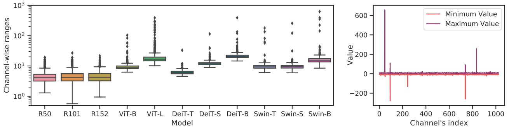
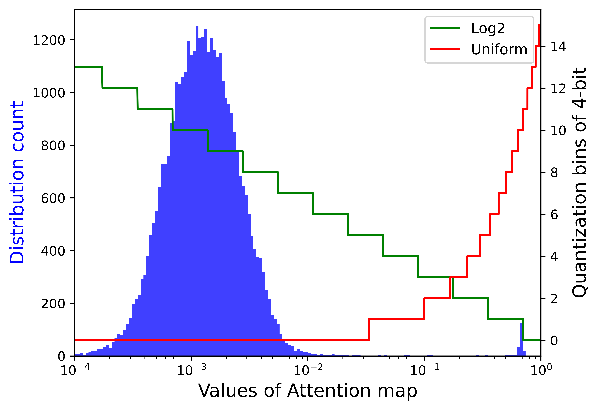
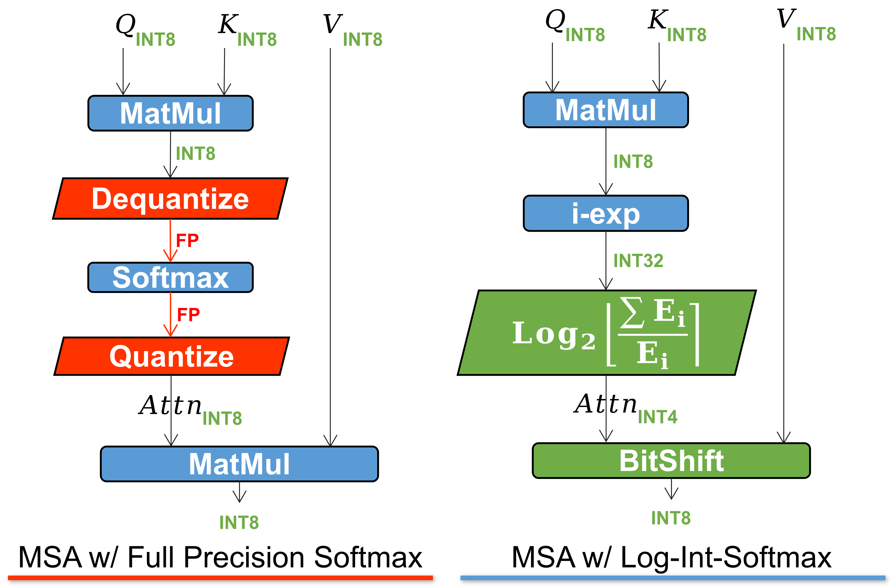

# FQ-ViT [[arXiv]](http://arxiv.org/abs/2111.13824) [[Slide]](https://github.com/megvii-research/megvii-tsinghua-dl-course/blob/2829138057a30df8797efb7cd3c1072042d9575e/quant-vision-transformer.pdf)


This repo contains the official implementation of **["FQ-ViT: Post-Training Quantization for Fully Quantized Vision Transformer"](http://arxiv.org/abs/2111.13824).**


## Table of Contents
  - [Introduction](#introduction)
    - [Layernorm quantized with Power-of-Two Factor (PTF)](#layernorm-quantized-with-power-of-two-factor-ptf)
    - [Softmax quantized with Log-Int-Softmax (LIS)](#softmax-quantized-with-log-int-softmax-lis)
  - [Getting Started](#getting-started)
    - [Install](#install)
    - [Data preparation](#data-preparation)
    - [Run](#run)
  - [Results on ImageNet](#results-on-imagenet)
  - [Citation](#citation)
  - [Join Us](#join-us)


## Introduction

Transformer-based architectures have achieved competitive performance in various CV tasks. Compared to the CNNs, Transformers usually have more parameters and higher computational costs, presenting a challenge when deployed to resource-constrained hardware devices.

Most existing quantization approaches are designed and tested on CNNs and lack proper handling of Transformer-specific modules. Previous work found there would be significant accuracy degradation when quantizing LayerNorm and Softmax of Transformer-based architectures. As a result, they left **LayerNorm and Softmax unquantized with floating-point numbers**. We revisit these two exclusive modules of the Vision Transformers and discover the reasons for degradation. In this work, we propose the **FQ-ViT**, the first fully quantized Vision Transformer, which contains two specific modules: Power-of-Two Factor (PTF) and Log-Int-Softmax (LIS).

### Layernorm quantized with Power-of-Two Factor (PTF)

  These two figures below show that there exists serious inter-channel variation in Vision Transformers than CNNs, which leads to unacceptable quantization errors with layer-wise quantization.

  <div align=center>
  
  </div>

  Taking the advantages of both layer-wise and channel-wise quantization, we propose PTF for LayerNorm's quantization. The core idea of PTF is to equip different channels with different Power-of-Two Factors, rather than different quantization scales.

### Softmax quantized with Log-Int-Softmax (LIS)

  The storage and computation of attention map is known as a bottleneck for transformer structures, so we want to quantize it to extreme lower bit-width (e.g. 4-bit). However, if directly implementing 4-bit uniform quantization, there will be severe accuracy degeneration. We observe a distribution centering at a fairly small value of the output of Softmax, while only few outliers have larger values close to 1. Based on the following visualization, Log2 preserves more quantization bins than uniform for the small value interval with dense distribution.

  <div align=center>
  
  </div>

  Combining Log2 quantization with i-exp, which is a polynomial approximation of exponential function presented by [I-BERT](https://arxiv.org/abs/2101.01321), we propose LIS, an integer-only, faster, low consuming Softmax.

  The whole process is visualized as follow.

  <div align=center>
  
  </div>

## Getting Started

### Install

- Clone this repo.

```bash
git clone https://github.com/linyang-zhh/FQ-ViT.git
cd FQ-ViT
```

- Create a conda virtual environment and activate it.

```bash
conda create -n fq-vit python=3.7 -y
conda activate fq-vit
```

- Install PyTorch and torchvision. e.g.,

```bash
conda install pytorch=1.7.1 torchvision cudatoolkit=10.1 -c pytorch
```

### Data preparation

You should download the standard ImageNet Dataset.

```
├── imagenet
│   ├── train
│
│   ├── val
```


### Run

Example: Evaluate quantized DeiT-S with MinMax quantizer and our proposed PTF and LIS.

```bash
python test_quant.py deit_small <YOUR_DATA_DIR> --quant --ptf --lis --quant-method minmax

```

- `deit_small`: model architecture, which can be replaced by `deit_tiny`, `deit_base`, `vit_base`, `vit_large`, `swin_tiny`, `swin_small` and `swin_base`.

- `--quant`: whether to quantize the model.

- `--ptf`: whether to use **Power-of-Two Factor Integer Layernorm**.

- `--lis`: whether to use **Log-Integer-Softmax**.

- `--quant-method`: quantization methods of activations, which can be chosen from `minmax`, `ema`, `percentile` and `omse`.

## Results on ImageNet

We compare our methods with several post-training quantization strategies, including MinMax, EMA, Percentile, OMSE, Bit-Split, and PTQ for ViT.

The following results are evaluated on ImageNet.

|     Method     | W/A/Attn Bits | DeiT-T | DeiT-S | DeiT-B | ViT-B | ViT-L | Swin-T | Swin-S | Swin-B |
| :------------: | :-----------: | :----: | :----: | :----: | :---: | :---: | :----: | :----: | :----: |
| Full Precision |   32/32/32    | 72.21  | 79.85  | 81.85  | 84.53 | 85.81 | 81.35  | 83.20  | 83.60  |
|     MinMax     |     8/8/8     | 70.94  | 75.05  | 78.02  | 23.64 | 3.37  | 64.38  | 74.37  | 25.58  |
|      EMA       |     8/8/8     | 71.17  | 75.71  | 78.82  | 30.30 | 3.53  | 70.81  | 75.05  | 28.00  |
|   Percentile   |     8/8/8     | 71.47  | 76.57  | 78.37  | 46.69 | 5.85  | 78.78  | 78.12  | 40.93  |
|      OMSE      |     8/8/8     | 71.30  | 75.03  | 79.57  | 73.39 | 11.32 | 79.30  | 78.96  | 48.55  |
|   Bit-Split    |     8/8/8     |   -    | 77.06  | 79.42  |   -   |   -   |   -    |   -    |   -    |
|  PTQ for ViT   |     8/8/8     |   -    | 77.47  | 80.48  |   -   |   -   |   -    |   -    |   -    |
|      Ours      |     8/8/8     | 71.61  | 79.17  | 81.20  | 83.31 | 85.03 | 80.51  | 82.71  | 82.97  |
|      Ours      |   8/8/**4**   | 71.07  | 78.40  | 80.85  | 82.68 | 84.89 | 80.04  | 82.47  | 82.38  |

## Citation

If you find this repo useful in your research, please consider citing the following paper:

```BibTex
@inproceedings{lin2022fqvit,
  title={FQ-ViT: Post-Training Quantization for Fully Quantized Vision Transformer},
  author={Lin, Yang and Zhang, Tianyu and Sun, Peiqin and Li, Zheng and Zhou, Shuchang},
  booktitle={Proceedings of the Thirty-First International Joint Conference on Artificial Intelligence, {IJCAI-22}},
  pages={1173--1179},
  year={2022}
}
```

## Join Us

Welcome to be a member (or an intern) of our team if you are interested in Quantization, Pruning, Distillation, Self-Supervised Learning and Model Deployment.

Please send your resume to sunpeiqin@megvii.com.
